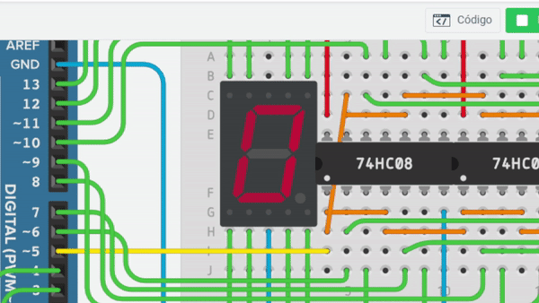
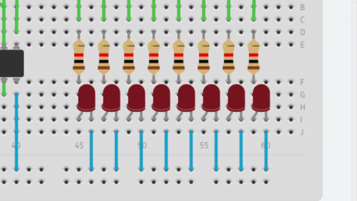
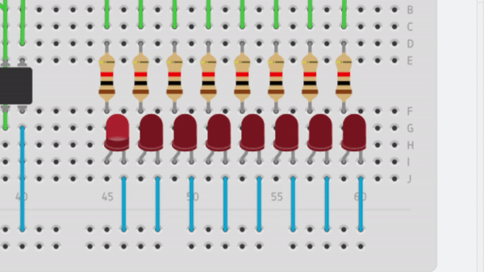
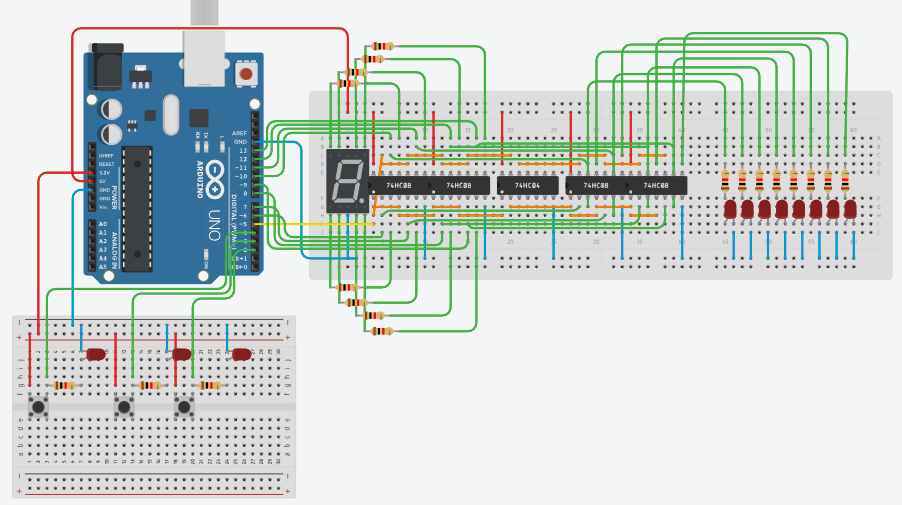

# ContadoresArduino
Proyecto de arduino con entradas/salidas paralelas, cuenta con tres modos, contador 7 segmentos, contador binario y recorrido led (arreglo de 8 leds)

## Funcionalidades.
1. Contador automático 0 - 9 ida y vuelta (display 7 segmentos).
2. Contador manual (display 7 segmentos).
3. Recorrido led automático (Arreglo de 8 leds).
4. Recorrido led manual (Arreglo de 8 leds).
5. Contador binario automático (Arreglo de 8 leds).
6. Contador binario manual (Arreglo de 8 leds).

## Operación.

Al conectar el circuito al arduino se mostrará en el display un menú del 1 al 6 que corresponede a cada uno de los programas, para entrar al programa debe presionar el botón conectado al pin 4 del arduino, una vez adentro puede presionarlo otra vez para salir, para seleccionar los demás programas use los botones conectados la pin 2 y 3 para aumentar o decrementar el número, tambien estos serán los botones para manupular los programas manuales.

Puede ver el proyecto [aqui](https://www.tinkercad.com/things/50wdIGasXaj-brilliant-maimu/editel?sharecode=G_ztzbXRIMwCeVxeprYE33Swn8ezzcdipENngsDLMLU).

## Componentes fisicos necesarios.

* Placa Arduino UNO o similar. x1 
* Compuertas lógicas AND (7408). x4
* Compuertas lógicas NOT (7404). x1
* Display de 7 segmentos. x1
* Led cualquier color. min x8, usados en el diagrama x11
* Resistencias min 330Ω. x16
* Resistencias 10k. x3 (leer nota)
* Botones. x3

> Las resistencias de 10k son para los botones que van a los pines de entrada, en https://www.tinkercad.com/ no funcionaron correctanente pero te recomiendo que en fisico las agregues para proteger tu arduino.

